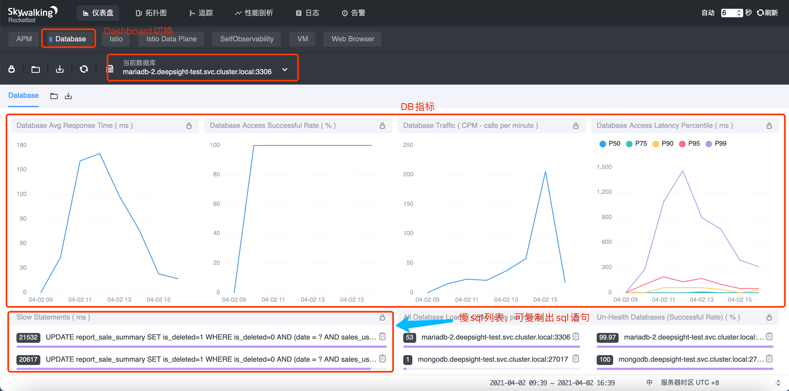
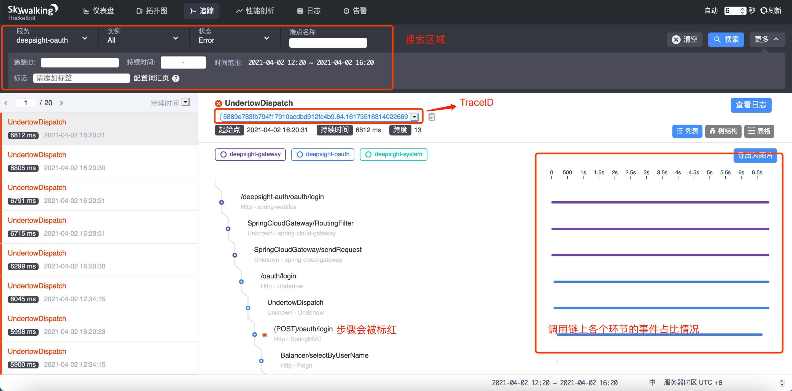
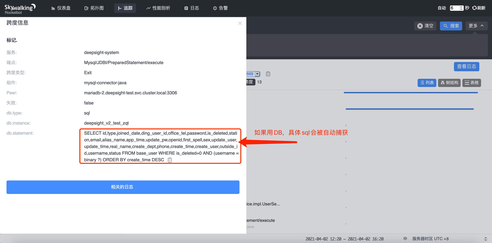

# SkyWalking测试方案以及使用说明

### 简介：

##### skywalking是Apache下面的一个开源的分布式链路追踪系统(APM). 创始人，吴晟。前华为技术专家，目前是Apache基金会的会员。

------


### Abstract 

**SkyWalking** is an open source APM system, including monitoring, tracing, diagnosing capabilities for distributed system in Cloud Native architecture. The core features are following.

- Service, service instance, endpoint metrics analysis
- Root cause analysis. Profile the code on the runtime
- Service topology map analysis
- Service, service instance and endpoint dependency analysis
- Slow services and endpoints detected
- Performance optimization
- Distributed tracing and context propagation
- Database access metrics. Detect slow database access statements(including SQL statements)
- Alarm
- Browser performance monitoring
- Infrastructure(VM, network, disk etc.) monitoring
- Collaboration across metrics, traces, and logs

**[Github项目地址](https://github.com/apache/skywalking)**

==**Architecture ：**==


------


#### 1、java-Agent配置

首先下载`apache-skywalking-apm-8.4.0.tar.gz`安装包并解压，保证`apache-skywalking-apm-bin`文件夹和创建的dockerfile处于同一目录下，dockerfile内容如下所示。由于官方没有提供agent docker镜像，需要自己定义Agent部署方式。

**Agent部署方式大致分为两种**

- Sidecar。通过initContainers将Agent拷贝到Pod到共享目录中，将此目录挂到主容器中，在启动服务时指定Agent.jar的目录启动java服务。如：

  ```sh
  java -javaagent:/usr/skywalking/agent/skywalking-agent.jar -jar app.jar --spring.profiles.active=test
  ```

- 直接打包到java基础镜像中。在配置JDK基础镜像时，直接将skywalking Agent程序打包到基础镜像中，springboot服务启动时候直接指定aent.jar的目录，或者通过参数传入docker中。

  ```sh
  export JAVA_OPTS=-javaagent:/root/skywalking/agent/skywalking-agent.jar
  ```

- Dockerfile

```dockerfile
# 执行镜像构建前先下载skywalking包到当前目录
# wget https://mirrors.tuna.tsinghua.edu.cn/apache/skywalking/8.4.0/apache-skywalking-apm-8.4.0.tar.gz && tar -zxvf apache-skywalking-apm-8.4.0.tar.gz
FROM busybox:latest 

ENV LANG=C.UTF-8

RUN set -eux && mkdir -p /usr/skywalking/agent/

ADD apache-skywalking-apm-bin/agent/ /usr/skywalking/agent/

WORKDIR /
```

- Plugin 配置，默认自带插件存放在`plugins`目录，可选插件存放在`optional-plugins`目录中，根据自己的应用场景进行选择，如果需要启用某个插件，只要将对应的jar包拷贝到`plugins`目录即可。如下图：


##### 注入Agent访问流程


#### 2、Deployment-template

> ```yaml
> ---
> # Deployment include Skywalking Agent of Sidecar. The Version's 8.4.0-es6
> # This is Gateway service for springcloudAlibaba
> # By John Wang 2021-03-25 PM 11:30
> apiVersion: apps/v1
> kind: Deployment
> metadata:
>   name: deepsight-gateway
>   namespace: deepsight-test
>   labels:
>     app: deepsight-gateway
> spec:
>   replicas: 1
>   selector:
>     matchLabels:
>       app: deepsight-gateway
>   template:
>     metadata:
>       labels:
>         app: deepsight-gateway
>     spec:
>       imagePullSecrets:
>       - name: registry-pull-secret
>       initContainers:
>         - image: hub.deepsight.cloud/skywalking/skywalking-agent-sidecar:8.4.0
>           name: sw-agent-sidecar
>           imagePullPolicy: IfNotPresent
>           command: ["sh"]
>           args:
>             [
>             "-c",
>             "mkdir -p /skywalking/agent && cp -r /usr/skywalking/agent/* /skywalking/agent",
>             ]
>           volumeMounts:
>             - mountPath: /skywalking/agent
>               name: sw-agent
>       containers:
>       - name: ds-gateway
>         image:  $IMAGE_NAME
>         imagePullPolicy: IfNotPresent
>         command: ["java"]
>         args:
>           [
>            "-javaagent:/usr/skywalking/agent/skywalking-agent.jar", "-jar", "app.jar","--spring.profiles.active=test",
>           ]
>         env:
>           - name: SW_AGENT_NAME # 定义服务名称,在skywalking UI中显示服务的实例名称
>             value: deepsight-gateway
>           - name: SW_AGENT_COLLECTOR_BACKEND_SERVICES # 定义OAP server Addresses
>             value: oap.skywalking:11800 
>           - name: SERVER_PORT # 配置java服务启动的端口，如果已经指定将此行注释
>             value: "8080"
>         resources:
>           limits:
>             memory: "700Mi"
>             cpu: "700m"
>           requests:
>             memory: "512Mi"
>             cpu: "500m"
>         readinessProbe:
>           httpGet:
>            path: /actuator/health
>            port: 80
>           initialDelaySeconds: 30 # 容器启动后多少秒开始健康检查
>           periodSeconds: 10 # Inspection interval
>         livenessProbe:
>           httpGet:
>             path: /actuator/health
>             port: 80
>           initialDelaySeconds: 30
>           periodSeconds: 10
>         ports:
>         - containerPort: 80
>           name: httpservice
>           protocol: TCP
>         volumeMounts:
>         - name: host-time
>           mountPath: /etc/localtime
>         - name: sw-agent
>           mountPath: /usr/skywalking/agent
>       volumes:
>         - name: sw-agent
>           emptyDir: {}
>         - name: host-time
>           hostPath:
>             path: /etc/localtime
> ---
> # Serivce For Deepsight-Gateway
> apiVersion: v1
> kind: Service
> metadata:
>   name: deepsight-gateway
>   namespace: deepsight-test
>   labels:
>     app: deepsight-test
> spec:
>   ports:
>   - name: web
>     port: 80
>     protocol: TCP
>     targetPort: 80
>   selector:
>     app: deepsight-gateway
>   
> ```

上面展示的deployment文件中，Agent部署方式通过`sidecar`的方式注入到java服务中，这样做对原服务镜像无需任何修改，兼容性和

灵活性强。


#### 3、配置Elasticsearch集群环境

通过emptyDir的方式部署在kubernetes中，无需部署index的清理策略，配置文件中recordDataTTL、otherMetricsDataTTL和monthMetricsDataTTL已经设置了数据留存的时间

- Elasticsearch 部署template，由于数据不做长期保存，所以存储使用`emptyDir`的卷的方式挂载 Elasticsearch数据;

  ```yaml
  apiVersion: apps/v1
  kind: StatefulSet
  metadata:
    name: elasticsearch
    namespace: skywalking
  spec:
    replicas: 3
    selector:
      matchLabels:
        app: elasticsearch
    serviceName: elasticsearch
    template:
      metadata:
        labels:
          app: elasticsearch
      spec:
        imagePullSecrets:
        - name: registry-pull-secret
        containers:
        - env:
          - name: cluster.name
            value: k8s-logs
          - name: node.name
            valueFrom:
              fieldRef:
                apiVersion: v1
                fieldPath: metadata.name
          - name: discovery.zen.ping.unicast.hosts
            value: elasticsearch-0.elasticsearch,elasticsearch-1.elasticsearch,elasticsearch-2.elasticsearch
          - name: discovery.zen.minimum_master_nodes
            value: "2"
          - name: ES_JAVA_OPTS
            value: -Xms512m -Xmx512m
          image: hub.deepsight.cloud/skywalking/elasticsearch:6.4.3
          imagePullPolicy: Always
          name: elasticsearch
          ports:
          - containerPort: 9200
            name: rest
            protocol: TCP
          - containerPort: 9300
            name: inter-node
            protocol: TCP
          resources:
            limits:
              cpu: "1"
            requests:
              cpu: 100m
          volumeMounts:
          - mountPath: /usr/share/elasticsearch/data
            name: data
        initContainers:
        - command:
          - sh
          - -c
          - chown -R 1000:1000 /usr/share/elasticsearch/data
          image: busybox
          imagePullPolicy: Always
          name: fix-permissions
          securityContext:
            privileged: true
          terminationMessagePath: /dev/termination-log
          terminationMessagePolicy: File
          volumeMounts:
          - mountPath: /usr/share/elasticsearch/data
            name: data
        - command:
          - sysctl
          - -w
          - vm.max_map_count=262144
          image: busybox
          imagePullPolicy: Always
          name: increase-vm-max-map
          resources: {}
          securityContext:
            privileged: true
          terminationMessagePath: /dev/termination-log
          terminationMessagePolicy: File
        - command:
          - sh
          - -c
          - ulimit -n 65536
          image: busybox
          imagePullPolicy: Always
          name: increase-fd-ulimit
          resources: {}
          securityContext:
            privileged: true
        volumes:
        - emptyDir: {}
          name: data
  
  ---
  kind: Service
  apiVersion: v1
  metadata:
    name: elasticsearch
    namespace: skywalking
    labels:
      app: elasticsearch
  spec:
    selector:
      app: elasticsearch
    clusterIP: None
    ports:
      - port: 9200
        name: rest
      - port: 9300
        name: inter-node
  
  ---
  kind: Service
  apiVersion: v1
  metadata:
    name: elasticsearch-logging
    namespace: skywalking
    labels:
      app: elasticsearch
  spec:
    selector:
      app: elasticsearch
    ports:
      - port: 9200
        name: external
  ```

  

#### 4、配置OAP 和UI deployment

- OAP server yaml

  ```yaml
  ---
  apiVersion: apps/v1
  kind: Deployment
  metadata:
    name: skywalking-oap
    namespace: skywalking
  spec:
    replicas: 2
    selector:
      matchLabels:
        app: skywalking-oap
    template:
      metadata:
        labels:
          app: skywalking-oap
      spec:
        serviceAccountName: skywalking-oap-sa
        containers:
        - name: oap
          image: hub.deepsight.cloud/skywalking/skywalking-oap-server:8.4.0-es6
          imagePullPolicy: Always
          livenessProbe:
            tcpSocket:
              port: 12800
            initialDelaySeconds: 15
            periodSeconds: 20
          readinessProbe:
            tcpSocket:
              port: 12800
            initialDelaySeconds: 15
            periodSeconds: 20
          ports:
          - containerPort: 11800
            name: grpc
          - containerPort: 12800
            name: rest
          resources:
            requests:
              memory: 1Gi
            limits:
              memory: 2Gi
          env:
          - name: JAVA_OPTS
            value: "-Xmx2g -Xms2g"
          - name: SW_CLUSTER
            value: standalone
          - name: SKYWALKING_COLLECTOR_UID
            valueFrom:
              fieldRef:
                fieldPath: metadata.uid
          - name: SW_STORAGE
            value: elasticsearch
          - name: SW_STORAGE_ES_CLUSTER_NODES
            value: elasticsearch-logging:9200
          - name: SW_NAMESPACE
            value: skywalking
        imagePullSecrets:
        - name: registry-pull-secret
  ---
  apiVersion: v1
  kind: Service
  metadata:
    name: skywalking-oap
    namespace: skywalking
    labels:
      app: skywalking-oap
  spec:
    ports:
    - port: 12800
      name: rest
    - port: 11800
      name: grpc
    selector:
      app: skywalking-oap
  ---
  ```


- UI deployment yaml

  ```yaml
  apiVersion: apps/v1
  kind: Deployment
  metadata:
    name: ui-deployment
    namespace: skywalking
    labels:
      app: ui
  spec:
    replicas: 1
    selector:
      matchLabels:
        app: ui
    template:
      metadata:
        labels:
          app: ui
      spec:
        imagePullSecrets:
        - name: registry-pull-secret
        containers:
        - name: ui
          image: hub.deepsight.cloud/skywalking/skywalking-ui:8.4.0
          imagePullPolicy: Always
          ports:
          - containerPort: 8080
            name: page
          resources:
            requests:
              memory: 1Gi
            limits:
              memory: 2Gi
          env:
          - name: SW_OAP_ADDRESS
            value: skywalking-oap.skywalking:12800
  ---
  apiVersion: v1
  kind: Service
  metadata:
    name: ui
    namespace: skywalking
    labels:
      service: ui
  spec:
    ports:
    - port: 8080
      name: page
    selector:
      app: ui
    type: NodePort
  ```

- skywaling ServiceAccount

  ```yaml
  # 根据版本可做相应的修改
  ---
  apiVersion: v1
  kind: ServiceAccount
  metadata:
    name: skywalking-oap-sa
    namespace: skywalking
  ---
  
  
  kind: ClusterRoleBinding
  apiVersion: rbac.authorization.k8s.io/v1
  metadata:
    name: skywalking-clusterrolebinding
  subjects:
  - kind: Group
    name: system:serviceaccounts:skywalking
    apiGroup: rbac.authorization.k8s.io
  roleRef:
    kind: ClusterRole
    name: skywalking-clusterrole
    apiGroup: rbac.authorization.k8s.io
  ---
  
  kind: ClusterRole
  apiVersion: rbac.authorization.k8s.io/v1
  metadata:
    name: skywalking-clusterrole
  rule:
  - apiGroup: [""]
    resources: ["pods"]
    verbs: ["get", "watch", "list"]
  ---
  ```


#### 5、通过UI观察集群微服务链路状态


##### UI访问界


##### 指标界面


- 最上方为功能区，用来切换SW不同的功能；

- 功能下方为指标对象，SW监控对象分为`服务`  `端点` `实例`三种；

- 右下角为时区，用来设定统计指标的时间区域。点击右上角 `自动`按钮开启自动刷新模式；

- 其余空间为指标盘展示区域；

- 服务器(service)：表示对请求提供相同行为的一系列或一组工作负载。

  > 这里，我们可以看到 应用的**服务**为 `"deepsight-gateway"`，这是在agent 环境变量 `SW_AGENT_NAME` 中所定义的。

- 端点(Endpoint)：对于特定服务所接收的请求路径, 如 HTTP 的 URI 路径和 gRPC 服务的类名 + 方法签名。

  > 这里，我们可以看到 Spring Boot 应用的一个**端点**，为 API 接口 `/deepsight-express/express/confrmReceipt`。

- 服务实例(Service Instance)：上述的一组工作负载中的每一个工作负载称为一个实例。就像 Kubernetes 中的 pods 一样, 服务实例未必就是操作系统上的一个进程。但当你在使用 Agent 的时候, 一个服务实例实际就是操作系统上的一个真实进程。

  > 这里，我们可以看到 Spring Boot 应用的**实例**为 `{进程UUID}@{hostname}`，由 Agent 自动生成。

##### 服务指标

点击**仪表盘**，选择需要查询的应用，如：**deepsight-oauth**，再切换仪表盘为**service**模式，即可查询对应的服务指标


##### 服务慢端点(Service Slow Endpoint)

服务指标仪表盘会列举出当前服务响应时间最大的端点Top5，如果有端点的响应时间过高，则需要进一步关注其指标（点击可以复制端点名称）。


##### 端点指标

如果发现有端点的响应时间过高，可以进一步查询该端点的指标信息。和服务指标类似，端点指标也包括吞吐量、SLA、响应时间等指标


##### 服务实例指标

选择服务的实例并切换仪表盘，即可查看服务某个实例的指标数据。除了常规的吞吐量、SLA、响应时间等指标外，实例信息中还会给出JVM的信息，如堆栈使用量，GC耗时和次数等。


##### DB数据查询指标

除了服务本身的指标，SW也监控了服务依赖的DB指标。切换DB指标盘并选择对应DB实例，就可以看到从服务角度（client）来看该DB实例的吞吐量、SLA、响应时间等指标。

**更进一步，该DB执行慢SQL会被自动列出，可以直接粘贴出来，便于定位耗时原因。**




##### 拓扑结构

- **不同于仪表盘来展示单一服务的指标，拓扑图是来展示服务和服务之间的依赖关系。**
- **用户可以选择单一服务查询，也可以将多个服务设定为一组同时查询。**
- **点击服务图片会自动显示当前的服务指标；**
- **SW会根据请求数据，自动探测出依赖的服务，DB和中间件等。**
- **点击依赖线上的圆点，会显示服务之间的依赖情况，如每分钟吞吐量，平均延迟时间，和侦察端模式（client/Server）**


##### 请求追踪

当用户发现服务的SLA降低，或者某个具体的端口响应时间上扬明显，可以使用追踪功能查询具体的请求记录。

- 最上方为搜索区，用户可以指定搜索条件，如隶属于哪个服务、哪个实例、哪个端口，或者请求是成功还是失败；也可以根据上文提到的TraceID精确查询。
- 整个调用链上每一个跨度的耗时和执行结果都会被列出（默认是列表，也可选择树形结构和表格的形式）；
- 如果有步骤失败，该步骤会标记为红色。




- 点击跨度，会显示跨度详情，如果有异常发生，异常的种类、信息和堆栈都会被自动捕获；


- 如果跨度为数据库操作，执行的SQL也会被自动记录。




##### 性能剖析

追踪功能展示出的跨度是服务调用粒度的，如果要看应用实时的堆栈信息，可以选择性能剖析功能。

- 新建分析任务；
- 选指定的服务和端点作为分析对象；
- 设定采样频率和次数；


新建任务后，SW将开始采集应用的实时堆栈信息。采样结束后，用户点击分析即可查看具体的堆栈信息。

1. 点击跨度右侧的“查看”，可以看到调用链的具体详情；
2. 跨度目录下方是SW收集到的具体进程堆栈信息和耗时情况。


#### 6、alarm-setting

##### rule规则说明

```yaml
# Licensed to the Apache Software Foundation (ASF) under one
# or more contributor license agreements.  See the NOTICE file
# distributed with this work for additional information
# regarding copyright ownership.  The ASF licenses this file
# to you under the Apache License, Version 2.0 (the
# "License"); you may not use this file except in compliance
# with the License.  You may obtain a copy of the License at
#
#     http://www.apache.org/licenses/LICENSE-2.0
#
# Unless required by applicable law or agreed to in writing, software
# distributed under the License is distributed on an "AS IS" BASIS,
# WITHOUT WARRANTIES OR CONDITIONS OF ANY KIND, either express or implied.
# See the License for the specific language governing permissions and
# limitations under the License.

# Sample alarm rules.
rules:
  # Rule unique name, must be ended with `_rule`.
  service_resp_time_rule: # 服务响应时间
    metrics-name: service_resp_time # 度量名称
    op: ">"                         # 比较符
    threshold: 1000                 # 1000ms 预值，服务响应时间大于1s
    period: 10                      # 多久检查一次当前当前指标是否触发预值，这里设定为10m
    count: 3                        # 达到多少次触发告警，这里是3次
    silence-period: 5               # 多久之类忽略相同的告警信息，这里设定为5m
    message: Response time of service {name} is more than 1000ms in 3 minutes of last 10 minutes. # 告警消息
  service_sla_rule: # 服务SLA
    # Metrics value need to be long, double or int
    metrics-name: service_sla
    op: "<"
    threshold: 8000
    # The length of time to evaluate the metrics
    period: 10
    # How many times after the metrics match the condition, will trigger alarm
    count: 2
    # How many times of checks, the alarm keeps silence after alarm triggered, default as same as period.
    silence-period: 3
    message: Successful rate of service {name} is lower than 80% in 2 minutes of last 10 minutes
  service_resp_time_percentile_rule:
    # Metrics value need to be long, double or int
    metrics-name: service_percentile
    op: ">"
    threshold: 1000,1000,1000,1000,1000
    period: 10
    count: 3
    silence-period: 5
    message: Percentile response time of service {name} alarm in 3 minutes of last 10 minutes, due to more than one condition of p50 > 1000, p75 > 1000, p90 > 1000, p95 > 1000, p99 > 1000
  service_instance_resp_time_rule: # 服务实例响应时间
    metrics-name: service_instance_resp_time
    op: ">"
    threshold: 1000
    period: 10
    count: 2
    silence-period: 5
    message: Response time of service instance {name} is more than 1000ms in 2 minutes of last 10 minutes
  database_access_resp_time_rule:
    metrics-name: database_access_resp_time
    threshold: 1000
    op: ">"
    period: 10
    count: 2
    message: Response time of database access {name} is more than 1000ms in 2 minutes of last 10 minutes
  endpoint_relation_resp_time_rule: # 关联端点响应时间
    metrics-name: endpoint_relation_resp_time
    threshold: 1000
    op: ">"
    period: 10
    count: 2
    message: Response time of endpoint relation {name} is more than 1000ms in 2 minutes of last 10 minutes
#  Active endpoint related metrics alarm will cost more memory than service and service instance metrics alarm.
#  Because the number of endpoint is much more than service and instance.
#
#  endpoint_avg_rule:
#    metrics-name: endpoint_avg
#    op: ">"
#    threshold: 1000
#    period: 10
#    count: 2
#    silence-period: 5
#    message: Response time of endpoint {name} is more than 1000ms in 2 minutes of last 10 minutes

webhooks: # 告警产生后的回调地址,对接钉钉，微信，邮箱，实现方法在webhook服务中实现
  - http://skywalking-webhook-service:8080/skywalking/alarm

```

##### 告警规则配置项的说明：

- **Rule name：**规则名称，也是在告警信息中显示的唯一名称。必须以`_rule`结尾，前缀可自定义
- **Metrics name：**度量名称，取值为oal脚本中的度量名，目前只支持`long`、`double`和`int`类型。详见Official OAL script
- **Include names：**该规则作用于哪些实体名称，比如服务名，终端名（可选，默认为全部）
- **Exclude names：**该规则作不用于哪些实体名称，比如服务名，终端名（可选，默认为空）
- **Threshold：**阈值
- **OP：** 操作符，目前支持 `>`、`<`、`=`
- **Period：**多久告警规则需要被核实一下。这是一个时间窗口，与后端部署环境时间相匹配
- **Count：**在一个Period窗口中，如果values超过Threshold值（按op），达到Count值，需要发送警报
- **Silence period：**在时间N中触发报警后，在TN -> TN + period这个阶段不告警。 默认情况下，它和Period一样，这意味着相同的告警（在同一个Metrics name拥有相同的Id）在同一个Period内只会触发一次
- **message：**告警消息

SkyWalking的告警消息会通过 HTTP 请求进行发送，请求方法为 `POST`，`Content-Type` 为 `application/json`，其JSON 数据实基于`List<org.apache.skywalking.oap.server.core.alarm.AlarmMessage`进行序列化的。JSON数据示例：

```json
[{
    "scopeId": 1,
    "scope": "SERVICE",
    "name": "serviceA",
    "id0": 12,
    "id1": 0,
    "ruleName": "service_resp_time_rule",
    "alarmMessage": "alarmMessage xxxx",
    "startTime": 1560524171000
}, {
    "scopeId": 1,
    "scope": "SERVICE",
    "name": "serviceB",
    "id0": 23,
    "id1": 0,
    "ruleName": "service_resp_time_rule",
    "alarmMessage": "alarmMessage yyy",
    "startTime": 1560524171000
}]
```

##### 字段说明：

- **scopeId、scope：**所有可用的 Scope 详见 `org.apache.skywalking.oap.server.core.source.DefaultScopeDefine`
- **name：**目标 Scope 的实体名称
- **id0：**Scope 实体的 ID
- **id1：**保留字段，目前暂未使用
- **ruleName：**告警规则名称
- **alarmMessage：**告警消息内容
- **startTime：**告警时间，格式为时间戳

##### 告警信息截图


#### 7、UI相关参数详解

CPM:每分钟请求调用的次数

SLA: 服务等级协议（简称：SLA，全称：service level agreement）

百分位数：skywalking中有P50，P90，P95这种统计口径，就是百分位数的概念。

>    释义：在一个样本数据集合中，通过某个样本值，可以得到小于这个样本值的数据占整体的百分之多少，这个样本值的值就是这个百分数对应的百分位数。
>
>    举例：全公司参加考试，有百分之八十的人都低于60分，那么对于整个公司的考试成绩这个样本集合来说，第八十百分位数就是60；
>
>    图例：如下图，表示7月22日，14:56分这个时间点探针反馈的统计结果来看，有50%的请求响应时间低于60ms，有75%的请求响应时间低于60ms，有90%的请求响应时间低于550ms，有95%的请求响应时间低于550ms，有99%的请求响应时间低于550ms

